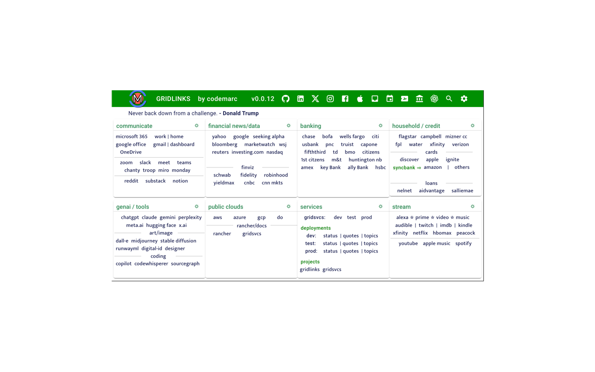

# [Gridlinks](https://codemarc.net/doc/gridlinks)

<a href="https://codemarc.net">a chrome extension by codemarc consulting.</a>

 

The complete [documentation](./doc/README.md) for this [project] is located in the   [docs] folder and using [docsify] we created the [gridlinks][docsite]   docsite, deployed at [codemarc.net/doc/gridlinks][docsite]. *You can install the latest version from the [chrome-web-store]*. If you are looking for the gridsvcs documentation, please see [gridsvcs](https://github.com/codemarc/gridsvcs).

[docsite]: https://codemarc.net/doc/gridlinks
[docsify]: "https://docsify.js.org/#/"

[project]: https://github.com/codemarc/gridlinks/tree/main
[docsite]: https://codemarc.net/doc/gridlinks
[docsify]: https://docsify.js.org/#/
[docs]: https://github.com/codemarc/gridlinks/tree/main/doc
[chrome-web-store]: https://chromewebstore.google.com/detail/gridlinks/ofpobifnipafncfehmgeknfkgojkbgke
