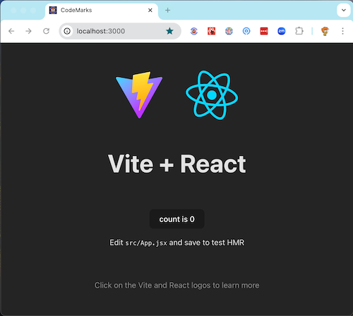

<a id="top"/>
<a href="https://codemarc.net">
   <br/>
   <a aria-label="gridlinks logo" href="https://codemarc.net/doc/gridlinks">
      
   </a>
   <font size="3">
      <br/><a href="https://codemarc.net">a chrome extension by codemarc</a>
      <br/>
   </font>
</a>


[Documentation](./doc/README.md) for this [project] is located in the   [docs] folder and using [docsify] we created the [gridlinks][docsite]   docsite, deployed at [codemarc.net/doc/gridlinks][docsite]. *You can install the latest version from the [chrome-web-store]*.

---

## Introduction

I have been building this application in one form or another for about 30 years. When I start something new, it is one of the first things I work on. More than "hello world", it is something that allows for and encourages learning; a new tool, process, framework, or language. Originally, this was a simple phone list, a quick way to get a phone number over time it has become more of a shared set of pointers to interesting information (a grid of links).

I can remember writing this as a command line tool in [cp/m] using [dbase II] and a [tsr popup] in [ms-dos] using [masm] to create a [borland sidekick] style phone lookup program. Later I remember writing in for [OS/2 pm] in 'C' and then again for [Windows 3.0] using c++ and [mfc], and again as a [netware nlm] and so on. Later it got rewritten in [Windows NT] as a [mmc snapin].

At one point I realized that browsers were next frontier and we got a [asp version] and then an [asp.net] in C#. And of course lets not forget the [java swing] and [servlet] forms.

So it is only natural that when [chrome extension] were introduced this tool found a whole new domain along with some requsite implementations. This will be the 9th time I create a [chrome extension] (my first was in 2017). They have been written as [vanilla html/javascript], [Vue.js] and finally [React].

For this particular version I will use [React + Vite][vite]


## Bootstrap

To get started we bootstrap the project using the vite generated scaffolding. That gets us the standard React starter program.

### [React](https://react.dev/) + [Vite](https://vitejs.dev/)

Ths extension was created following these steps

1. Create a new project
2. Install dependencies
3. Create a React application

```code
$ npm init vite@latest
✔ Project name: … gridlinks
✔ Select a framework: › React
✔ Select a variant: › JavaScript + SWC

Scaffolding project in wip/gridlinks...

Done. Now run:

  cd gridlinks
  yarn install
  yarn run dev
```

This creates `gridlinks` with a basic Vite configuration.

The template I used provided minimal setup to get React working in Vite with HMR and some ESLint rules.

Currently, two official plugins are available:

- [@vitejs/plugin-react](https://github.com/vitejs/vite-plugin-react/blob/main/packages/plugin-react/README.md) uses [Babel](https://babeljs.io/) for Fast Refresh
- [@vitejs/plugin-react-swc](https://github.com/vitejs/vite-plugin-react-swc) uses [SWC](https://swc.rs/) for Fast Refresh


## Opinionated

The gridlinks repository implements a logical and intuitive file layout/organization. The principle of 'convention over Configuration' offers significant insights. By embracing this layout as a standard, you can minimize the number of decisions to be made, thereby reducing complexity and allowing you to concentrate on content. The annotated structure is presented below. Some filenames have been excluded for brevity.

```code
GRIDLINKS
|   README.md               // a barebones readme to point at this file
|   .editorconfig           // config for the editor config plug
|   .gitignore              // stuff that git should ignore
|   package.json            // module definition
|   vite.config.js          // vite configuration
|   manifest.json           // manifest file for extension
|   index.html              // app loader
|
+---.vscode                 // common config when using vscode
|   extensions.json         // suggested extension vscode
|   gridlinks.code-profile  // vscode importable profile
|
+---doc                     // the full documentation to be deployed
|   package.json            // build and deploy the doc site
|   deploy.js               // deployment script
|   index.html              // docsify generated home page
|   README.md               // gridlinks doc starts here
|   +---img                 // doc images
|
+---assets                  // extension assets
|   logo16.png
|   logo32.png
|   logo48.png
|   logo128.png
|
+---public                  // folder for public assets
|
\---src                     // source code for the extension
    +---components
    +---data
    +---pages
        App.jsx
        App.css
        index.css
        main.jsx
        +---settings


```

---

### Chrome Extension

[Chrome extensions]⁠⁠ are software programs built on web technologies that customize the browser experience for a user. The Google developer documentation for building [chrome extensions] is available and the [Hello World](https://developer.chrome.com/docs/extensions/get-started/tutorial/hello-world) should be reviewed as a starting point for knowledge gathering.


#### vite.config.js

In order to build our chrome extension using [Vite] there are some additional items that must be managed.
Thankfully there is an open source plugin [CRXJS Vite Plugin] to bundle our extension. I suggest you update
your [Vite configuration](https://vitejs.dev/config/) to use the crxjs plugin and configure hmr (hot module replacement) server port definition. We also should add a starter [manifest.json](#chrome-extension)

yarn add -D @crxjs/vite-plugin

```json
import { defineConfig } from 'vite'
import react from '@vitejs/plugin-react-swc'

// https://crxjs.dev/vite-plugin
import { crx } from "@crxjs/vite-plugin"
import manifest from "./manifest.json"

// https://vitejs.dev/config/
export default defineConfig({
  plugins: [react(), crx({ manifest })],
  server: {
    port: 3000
  }
})
```

Beyond those changes I think we should add the use of the version from package.json which is documented in the help for [crxjs/manifest](https://crxjs.dev/vite-plugin/concepts/manifest)


#### manifest.json

Every [chrome extension] must include a manifest.json file that describes the extension's capabilities and configuration

```javascript
{
  "manifest_version": 3,
  "name": "Gridlinks",
  "description": "Codemarc's Gridlinks implementation - react vite based chrome extension starter",
  "homepage_url": "https://codemarc.net/doc/gridlinks/#/",
  "author": {
    "email": "codemarc@gmail.com"
  },
  "action": { "default_popup": "index.html" },
  "icons": {
    "16": "assets/logo16.png",
    "32": "assets/logo32.png",
    "48": "assets/logo48.png",
    "128": "assets/logo128.png"
  }
}
```

Lets review some of the items above

##### "action"

Defines the appearance and behavior of the extension's icon in the Google Toolbar. For more information, see [chrome.action](https://developer.chrome.com/docs/extensions/reference/api/action).

##### "icons"

I suggest you always provide all 4 icons 128x128, 48x48, 32x32 and 16x16 in png format. For information about best practices, see [Icons](https://developer.chrome.com/docs/extensions/reference/manifest/icons). Make sure you icon look good in all sizes. If you need to creaate a logo you can use any of the modern design tool for
insperation. I have used https://www.design.com/ for this purpose.

### Wash Rinse Repeat

If you have been following along you should be able to run
yarn build and see the following output:

```bash
marc:~/cmc/gridlinks$ yarn build
yarn run v1.22.22

$ vite build
vite v5.2.13 building for production...
✓ 36 modules transformed.
dist/index.html                       0.46 kB │ gzip:  0.30 kB
dist/manifest.json                    0.49 kB │ gzip:  0.28 kB
dist/.vite/manifest.json              0.54 kB │ gzip:  0.23 kB
dist/assets/logo16.png                3.17 kB
dist/assets/react-CHdo91hT.svg        4.13 kB │ gzip:  2.05 kB
dist/assets/logo32.png                6.81 kB
dist/assets/logo48.png               10.60 kB
dist/assets/logo128.png              27.66 kB
dist/assets/index-DiwrgTda.css        1.39 kB │ gzip:  0.72 kB
dist/assets/index.html-DONsvf3q.js  143.36 kB │ gzip: 46.09 kB
✓ built in 830ms
✨  Done in 1.42s.

```

or you could the the dev server....

```bash

marc:~/cmc/gridlinks$ yarn dev
yarn run v1.22.22

$ vite
Re-optimizing dependencies because vite config has changed

  VITE v5.2.13  ready in 363 ms

  ➜  Local:   http://localhost:3000/
  ➜  Network: use --host to expose
  ➜  press h + enter to show help
7:01:25 AM [crx] files start dist
7:01:26 AM [crx] files ready in 267ms
7:01:26 AM [vite] ✨ optimized dependencies changed. reloading
7:01:26 AM [crx] files start dist
7:01:26 AM [crx] files ready in 78ms

```

Then connect to http://localhost:3000




---

[Back «](#top)  __Gridlinks__  [» Next](design)


<!-- Engage Cloaking Device -->
[project]: https://github.com/codemarc/gridlinks/tree/main
[docsite]: https://codemarc.net/doc/gridlinks
[docsify]: https://docsify.js.org/#/
[docs]: https://github.com/codemarc/gridlinks/tree/main/doc

[cp/m]: https://en.wikipedia.org/wiki/CP/M
[dbase II]: https://en.wikipedia.org/wiki/DBase
[tsr popup]: https://en.wikipedia.org/wiki/Terminate-and-stay-resident_program
[ms-dos]:https://en.wikipedia.org/wiki/MS-DOS
[masm]: https://en.wikipedia.org/wiki/Microsoft_Macro_Assembler
[borland sidekick]: https://en.wikipedia.org/wiki/Borland_Sidekick
[os/2 pm]: https://en.wikipedia.org/wiki/Presentation_Manager
[Windows 3.0]: https://en.wikipedia.org/wiki/Windows_3.0
[mfc]: https://en.wikipedia.org/wiki/Microsoft_Foundation_Class_Library
[netware nlm]: https://en.wikipedia.org/wiki/NetWare_Loadable_Module
[Windows NT]: https://en.wikipedia.org/wiki/Windows_NT
[mmc snapin]: https://en.wikipedia.org/wiki/Microsoft_Management_Console
[asp version]: https://en.wikipedia.org/wiki/Active_Server_Pages
[asp.net]: https://en.wikipedia.org/wiki/ASP.NET
[java swing]: https://en.wikipedia.org/wiki/Swing_(Java)
[servlet]: https://en.wikipedia.org/wiki/Jakarta_Servlet
[chrome extension]: https://en.wikipedia.org/wiki/Google_Chrome#Extensions
[vanilla html/javascript]: https://en.wikipedia.org/wiki/JavaScript#Web_libraries_and_frameworks
[Vue.js]: https://en.wikipedia.org/wiki/Vue.js
[React]:https://en.wikipedia.org/wiki/React_(JavaScript_library)
[Vite]:https://en.wikipedia.org/wiki/Vite_(software)
[Chrome extensions]: https://developer.chrome.com/docs/extensions/mv3/
[CRXJS Vite Plugin]: https://crxjs.dev/vite-plugin
[chrome-web-store]: https://chromewebstore.google.com/detail/gridlinks/ofpobifnipafncfehmgeknfkgojkbgke
