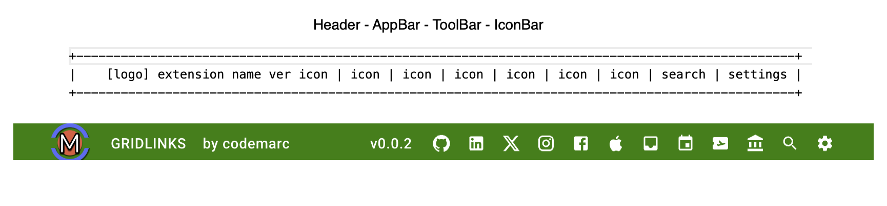

# Components

React components are the building blocks of any React application. They are JavaScript functions or classes that optionally accept inputs, called "props", and return a React element that describes how a section of the UI should appear.

## Header


The goal of step three is to turn the Header portion of the design into a Header component. We do this using standard MUI components and create a few of own.





## IconBar


At this point we can sanitize our two css files so we end up with

***App.css***
```css
#root {  width: 840px;  min-height: 376px;  line-height: 1;}

header {   height: 50px;   margin-top: -12px; }

#root > div > header > div > div > span > div svg {
   color: rgb(255 255 255);
   font-size: 20px;
   width: 18px;
   margin-left: 0px;
 }
```

and
***index.css***

```css
   ⋮
   a {
     font-weight: 500;
     color:white;
     text-shadow: 1px 1px 1px rgba(0, 0, 0, 0.5);
     text-decoration: inherit;
   }
   a:hover {
     color:white;
     text-decoration: inherit;
   }

   body {
     margin: 0;
     display: flex;
     min-width: 320px;
     min-height: 100vh;
   }
  ⋮
```

Where we  replaced the link color with white and remove the place-items:center style from the body

## Message of the Day


This is component was created using generative ai which is a computer program that takes in a lot of information (data), learns from it (artificial intelligence), and then comes up with something new all on its own (generative). In our case use OpenAI's ChatGPT 4o we create the message of the day component using this prompt:

> CodeMarc:
>
> create a list of "message of the day" quotes formatted as an array of json objects containing the fields message and author

<br/>

```code
ChatGPT:

[
    {
        "message": "The only way to do great work is to love what you do.",
        "author": "Steve Jobs"
    },
    {
        "message": "Success is not the key to happiness. Happiness is the key to success.",
        "author": "Albert Schweitzer"
    },
    {
        "message": "Believe you can and you're halfway there.",
        "author": "Theodore Roosevelt"
    },
    ⋮
]
```

> CodeMarc:
>
> regenerate the quotes and make sure there is at least 50 of them. Then save them as a file named quotes.json

```code
ChatGPT:

I have generated the JSON file with at least 50 quotes. You can download the file here. ​
```
> CodeMarc:
>
> using the json object as a data source create a react component that renders a message picked at random from the list

```code
import { useState, useEffect } from 'react'ß
import quotes from '../data/quotes.json'

const MessageOfTheDay = () => {
    const [quote, setQuote] = useState({});

    useEffect(() => {
        const randomIndex = Math.floor(Math.random() * quotes.length);
        setQuote(quotes[randomIndex]);
    }, []);

    return (
        <div>
            <h1>Message of the Day</h1>
            <p>"{quote.message}"</p>
            <p><strong>- {quote.author}</strong></p>
        </div>
    );
};

export default MessageOfTheDay
```

This is the genesis of the message of the day component. When you are ready, have a look at the source to see [the completed version](https://github.com/codemarc/gridlinks/blob/c6766d46ba7f8b6aa48db5ae1edf9afc8d172753/src/components/Motd.jsx).

---

[Back «](design)  __Components__  [» Next](pages)


