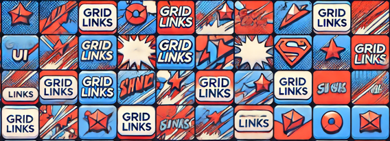
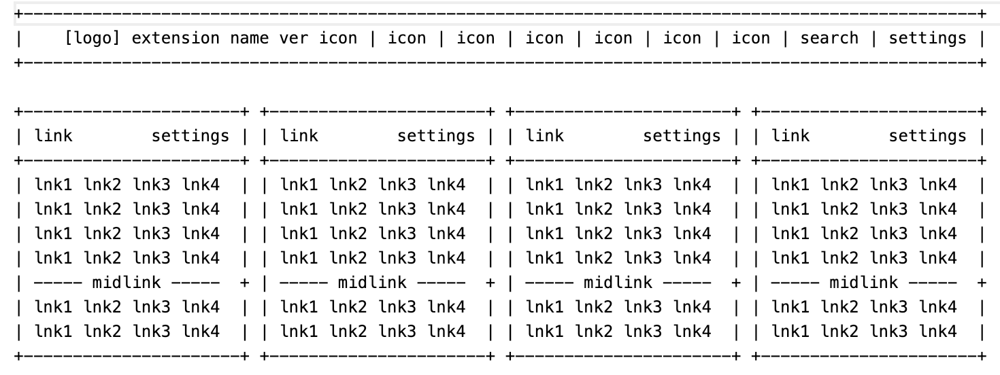

# Design

Creating a UI design for a Chrome extension involves understanding the primary functionality and ensuring a user-friendly experience. It startes with a vision.

## Purpose and Features

* Purpose
* Features

## Layout
* Main Toolbar Icon: This is the entry point for users to interact with your extension.
* Popup Interface: A small window that appears when the toolbar icon is clicked.
* Options Page: A more detailed settings page accessible from the popup or Chrome extensions settings.

## Design Elements
* Toolbar Icon: Simple, recognizable icon (16x16, 32x32, 48x48, 128x128).
* Popup Interface:
   * Header: Logo and Title and common key icons
   * Main Content: Key features and controls.
   * Settings Content: Links to settings and help.

4. Wireframe Example
Here's an example wireframe for a Chrome extension popup:

---

[Back «](README)  __Design__  [» Next](implement)